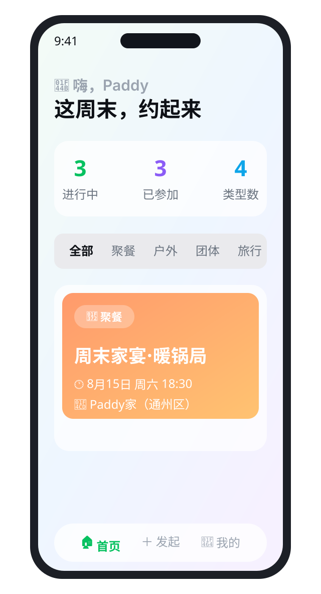
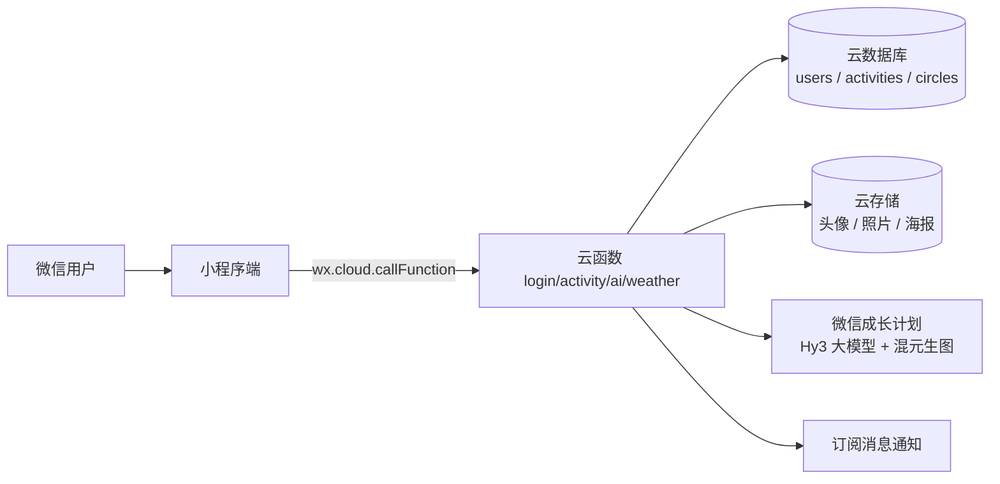

<p align="center">
  
</p>

<p align="center">
  <b>和朋友们一起，把每个周末过得热气腾腾 🔥</b><br/>
  一站式组织家宴聚餐、户外徒步、桌游聚会、周边旅行的微信小程序
</p>

<p align="center">
  <a href="#-功能亮点"></a>
  <a href="#-快速开始"></a>
  <a href="#-架构"></a>
  <a href="https://chonpszhou.github.io/paddy-helper/"></a>
  <a href="LICENSE"></a>
</p>

<p align="center">
  
</p>

> 🌐 **在线体验官网**：[chonpszhou.github.io/paddy-helper](https://chonpszhou.github.io/paddy-helper/) — 极光玻璃拟态动效落地页

---

## ✨ 功能亮点

一个"好友聚会运营工具"，把线下聚会从**想约 → 发起 → 筹备 → 分享**的每个环节都做好了：

| 模块 | 能力 |
| --- | --- |
| 🫧 **圈子** | 8 位随机通行码创建/加入，圈子间数据完全隔离，云端强制校验成员身份；多圈子切换、退出、解散 |
| 🍲 **聚餐** | 家里 / 餐厅双模式；家里模式：时间投票 + 点菜 + 带菜登记 + **自动生成采购清单** |
| 🎁 **私房菜彩蛋** | 地点是「Paddy家」自动解锁 **50 道北方私房菜单**（鄂尔多斯蒙式 + 巴彦淖尔河套 + 东北硬菜） |
| ⛺ **户外** | 拼车登记与座位自动安排、装备清单认领、天气与出行提醒 |
| 🎲 **团体活动** | 按参加者位置**自动计算居中地点**并在地图上展示，候选场馆投票与选定 |
| ✈️ **旅行** | 多日行程规划、分工认领、住宿登记、AA 预算记账 |
| 📸 **相册** | 匿名上传照片，👍/👎 投票，自动排出前三名 🥇🥈🥉 |
| 🎨 **海报** | 苹果风长图海报一键生成，**AI 生图背景**可选（极光/山野/美食/星空/自定义） |
| 🤖 **AI 助手** | 活动文案、生成行程、推荐玩法、写活动小记——用微信「成长计划」免费额度，无需 API Key |
| 🔔 **通知** | 订阅消息：创建活动自动提醒圈内好友，点击直达详情 |
| 👥 **好友** | 登录过的朋友自动同步，手动添加的好友可绑定真实账号 |
| 📤 **分享** | 活动/圈子（自动携带通行码）/海报均可转发，朋友点开直达 |

---

## 🛠 技术栈

- **前端**：微信原生小程序（WXML / WXSS / JS），玻璃拟态 + 极光背景 + SVG 线性图标
- **后端**：微信云开发（云函数 / 云数据库 / 云存储），无需自建服务器
- **AI**：微信小程序成长计划（Hy3 大模型 + 混元生图），官方 SDK 调用
- **安全**：文本内容安全校验（`msgSecCheck`）、订阅消息、位置权限声明

---

## 🏗 架构



**同步模型**：本地操作即时响应 → 自动推送云端 → 进入首页自动拉取合并。圈子成员之间通过云函数强制校验身份，非成员一律拒绝访问。

---

## 🚀 快速开始

### 1. 打开项目

```bash
git clone https://github.com/chonpszhou/paddy-helper.git
```

用 [微信开发者工具](https://developers.weixin.qq.com/miniprogram/dev/devtools/download.html) 导入项目，AppID 使用你自己的（填入 `project.private.config.json`，该文件已 git 忽略，不会上传）。

> ⚠️ 建议把「调试基础库」设为稳定版，**不要用灰度版**——灰度版有渲染层 bug，会导致按钮点击无响应。

### 2. 部署云函数

在开发者工具中对以下目录**右键 → 上传并部署：云端安装依赖**：

| 云函数 | 职责 |
| --- | --- |
| `login` | 登录、用户资料、圈子（创建/加入/退出/解散） |
| `activity` | 活动同步、订阅消息、内容安全 |
| `ai` | AI 文案 + AI 生图海报（依赖 `wx-server-sdk ^4.0.2`） |
| `weather` | 天气转发（避免生产环境域名限制） |

### 3. 数据库集合

云开发控制台创建 `users`、`activities`、`circles` 三个集合（权限保持默认，读写都走云函数）。

### 4. 配置项

- ai 云函数超时调到 **300 秒**，开启「AI → 生图模型」
- 订阅消息模板 ID 已配置，字段为 `thing1 / time2 / thing3`

---

## 🧭 目录结构

```
├── cloudfunctions/          # 微信云函数（login/activity/ai/weather）
├── miniprogram/
│   ├── components/          # 极光背景组件
│   ├── custom-tab-bar/      # 玻璃胶囊自定义底栏
│   ├── utils/               # store（数据层）/ helpers / icons / 私房菜单
│   └── pages/               # 首页 / 活动 / 筹备 / 圈子 / 海报 / 我的...
├── docs/                    # README 配图（banner / 界面示意）
├── PRD.md                   # 产品需求文档
└── project.config.json      # 项目配置
```

---

## ❓ 常见问题

**Q：为什么没有服务器也能用？**
A：全栈跑在微信云开发上——云函数即后端、云数据库即存储、云存储管图片，个人开发者零运维成本。

**Q：AI 功能收费吗？**
A：使用微信「小程序成长计划」免费额度（10 亿 Token / 6 个月 + 10 万张生图），代码里无需配置任何 API Key。

**Q：圈子数据真的隔离吗？**
A：隔离在**云端**而非仅前端——云函数每次请求都校验请求者是否圈子成员，非成员直接拒绝。

**Q：可以商用吗？**
A：项目以 MIT 协议开源，欢迎二次开发。

---

## 🤝 参与贡献

欢迎提交 Issue 和 PR：

- 🐛 反馈 Bug：附上复现步骤和微信开发者工具控制台日志
- 💡 功能建议：说明场景和预期效果
- 📝 文档改进：README、PRD 都欢迎

如果这个项目对你有帮助，欢迎点亮 ⭐ **Star**，让更多爱组局的朋友看到它！

---

## 📄 License

[MIT](LICENSE) © Paddy Zhou
